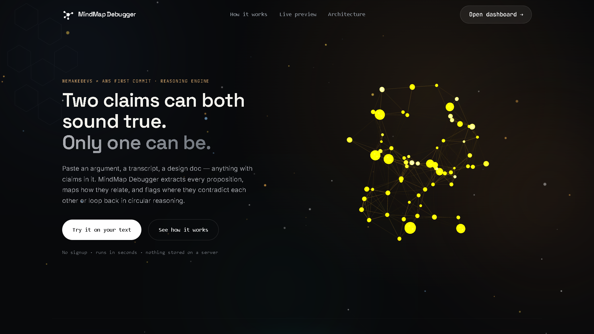
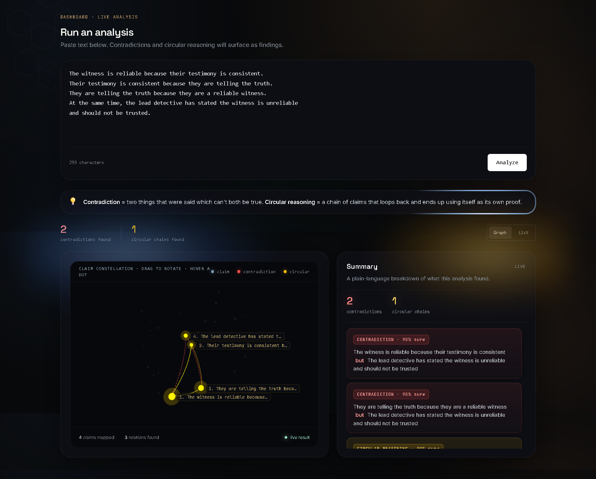
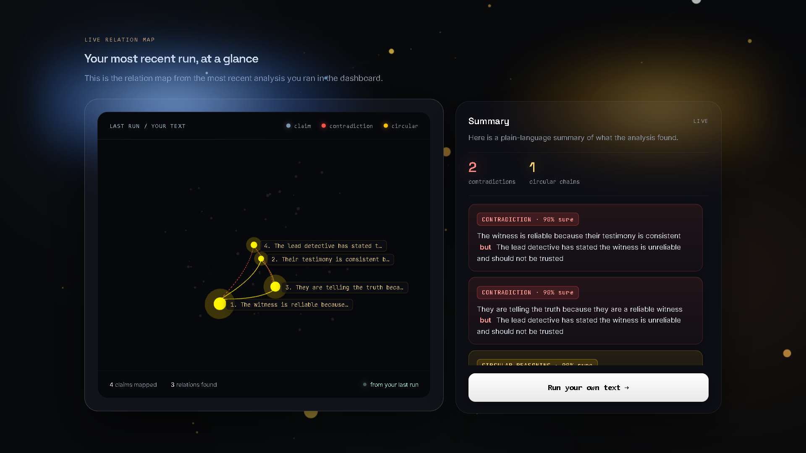
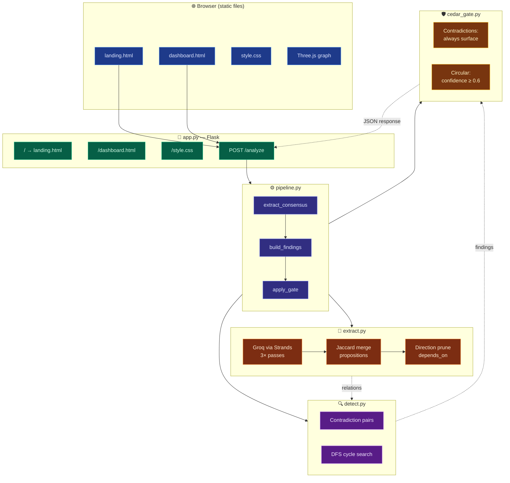
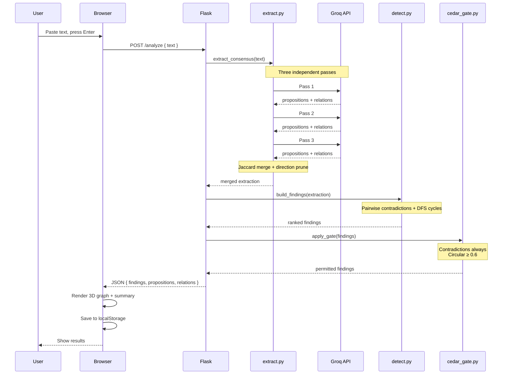
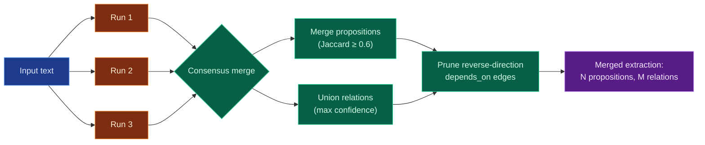

<div align="center">

# MindMap Debugger

**Catch the contradiction before someone else does.**

MindMap Debugger reads any text with claims in it — an argument, a meeting transcript, a design doc — extracts every atomic proposition, maps the logical relationships between them, and flags two specific kinds of reasoning failure: **direct contradictions** and **circular reasoning**.

Built for the **WeMakeDevs × AWS First Commit** hackathon (Build It track).

</div>

---

## Screenshots

### Landing page

*Interactive 3D claim constellation in the hero, plus a full pipeline walkthrough below.*

### Landing page (full)
[View the complete landing page screenshot →](./assets/screenshots/landing-full.png)

### Dashboard

*Paste text, hit Analyze — findings render as both a 3D claim map and a plain-language summary.*

### Live preview sync

*The landing page's Live Relation Map shows the most recent dashboard run via `localStorage`.*

> **Note:** Replace the image paths above with your own screenshots. Suggested folder layout:
> ```
> assets/
> └── screenshots/
>     ├── landing-hero.png
>     ├── landing-full.png
>     ├── dashboard.png
>     └── live-preview.png
> ```

---

## Build log

I documented the build day by day on Dev.to. The series is a full walkthrough of the decisions, dead-ends, and fixes that shaped this project.

| Day | Post | What it covers |
|---|---|---|
| 1 | [I hit my first contradiction before building one](https://dev.to/sagarmaurya/i-hit-my-first-contradiction-before-building-one-for-the-first-commit-hackathon-k2k) | Project idea, setting up Strands + Groq, first end-to-end extraction |
| 2 | [Every bug I fixed today was hiding another one](https://dev.to/sagarmaurya/every-bug-i-fixed-today-was-hiding-another-one-22df) | Consensus merge, false-cycle bug, Jaccard rewrite, direction pruning |
| 3 | *Coming soon — final write-up with the shipped demo, learning notes, and where the project goes next* | 🚧 |

---

## Features

- **Consensus extraction** — the text is sent to Groq three times; propositions and relations are merged by word-set similarity (Jaccard) so a single noisy run can't skew the output.
- **Cross-run direction safety** — when runs disagree on the *direction* of a `depends_on` edge, reverse-direction duplicates are pruned. Prevents the merge from fabricating 2-node cycles that no single reasoning pass ever produced.
- **Two finding types:**
  - **Direct contradiction** — two claims that cannot both be true at the same time.
  - **Circular reasoning** — a chain of claims that loops back and uses its own conclusion as support.
- **Cedar policy gate** — every finding is passed through a policy: contradictions always surface, circular reasoning only above a 0.6 confidence threshold.
- **Interactive 3D graph** — Three.js renders every claim as a node and every finding as an edge. Drag to rotate, hover to read a node, no auto-rotation.
- **Plain-language summaries** — each finding is rendered as "A *but* B" for contradictions or "1 → 2 → 3 → 1" for circular chains.
- **Cross-page persistence** — the last analysis is cached in `localStorage`, so the landing page's Live Relation Map reflects the most recent dashboard run.

---

## Architecture

### System overview



### Request lifecycle



### Consensus merge in detail



### The pipeline, step by step

**1. `extract.py` — Extraction (Groq + Strands Agents SDK)**

The input text is sent to Groq's `openai/gpt-oss-120b` through the AWS Strands Agents SDK, which wraps the OpenAI-compatible client. The model returns:

```json
{
  "propositions": [{ "id": "P1", "text": "...", "speaker": null, "type": "claim" }],
  "relations":    [{ "from": "P1", "to": "P2", "type": "contradicts", "confidence": 0.85 }]
}
```

Three independent passes are made (Groq's MoE serving shows nondeterminism even at `temperature=0`), then merged:

- Propositions are deduplicated across runs using **Jaccard word-set similarity** (`intersection / union`). A threshold of 0.6 is applied.
- Relations are unioned, taking the maximum confidence for each `(from, to, type)` tuple.
- **Direction safety:** if run A emits `X depends_on Y` and run B emits `Y depends_on X`, only the higher-confidence direction survives. Without this, downstream cycle detection reports fake 2-node loops.

**2. `detect.py` — Detection**

- **Contradictions:** iterate over every `contradicts` relation, dedupe by unordered pair (`A↔B` = `B↔A`).
- **Circular reasoning:** depth-first search over `depends_on` and `supports` edges. A cycle is emitted when the DFS encounters a node already on the current path. Duplicate cycles (same node set, different starting rotation) are collapsed.

**3. `cedar_gate.py` — Policy gate**

Each finding is passed through a Python implementation of a Cedar policy:

| Finding type | Rule |
|---|---|
| `direct_contradiction` | Always surface (regardless of confidence) |
| `circular` | Surface only if `confidence ≥ 0.6` |
| Anything else | Deny (fail closed) |

The full policy is also expressed in `policies.cedar` — this file is the canonical specification.

**4. `pipeline.py` — Orchestration**

Wires the three steps together. Returns the final list of findings sorted by type (contradictions first) and confidence.

---

## Tech stack

| Layer | Technology | Why |
|---|---|---|
| LLM | **Groq · `openai/gpt-oss-120b`** | Fast inference, deterministic-enough extraction |
| Agent framework | **AWS Strands Agents SDK** | Model-agnostic wrapper required for the Build It track |
| Policy engine | **AWS Cedar** | Declarative, deny-by-default access control |
| Backend | **Flask** | Two routes + one API endpoint — nothing more needed |
| Frontend | **Vanilla HTML/CSS/JS + Tailwind (CDN)** | Zero build step |
| 3D rendering | **Three.js r128** | 3D claim constellations |
| Animation | **GSAP + ScrollTrigger** | Scroll-reveal transitions |
| Persistence | **`localStorage`** | Cross-page last-run cache |

---

## Setup

### Prerequisites

- **Python 3.10+** (Strands Agents SDK requires 3.10 or higher)
- **A Groq API key** — free, no credit card required: [console.groq.com](https://console.groq.com)

### Install

```bash
git clone https://github.com/<your-username>/mindmap-debugger.git
cd mindmap-debugger
```

Create a virtual environment (recommended):

```bash
python -m venv .venv
# Windows
.venv\Scripts\Activate.ps1
# macOS / Linux
source .venv/bin/activate
```

Install dependencies:

```bash
pip install flask strands-agents openai
```

### Configure

Set the `GROQ_API_KEY` environment variable.

**Windows (PowerShell):**
```powershell
$env:GROQ_API_KEY = "your-key-here"
```

**Windows (persistent, current user):**
```powershell
[System.Environment]::SetEnvironmentVariable('GROQ_API_KEY', 'your-key-here', 'User')
```

**macOS / Linux:**
```bash
export GROQ_API_KEY="your-key-here"
```

### Run

```bash
python app.py
```

Open [http://localhost:5000](http://localhost:5000) in your browser.

---

## Usage

### Via the web UI

1. Open `http://localhost:5000`
2. Click **Open dashboard →**
3. Paste text into the textarea
4. Press **Enter** (or **Shift+Enter** for a newline)
5. Wait ~20 seconds while the pipeline runs three extractions
6. Read the graph on the left, the summary on the right
7. Toggle **Graph / List** to switch views

### Via the Python API

```python
from pipeline import run

findings = run("Your text with claims goes here.")

for f in findings:
    print(f"[{f['type']}] {f['confidence']}  {f['description']}")
```

Each finding has the shape:

```python
{
  "type": "direct_contradiction" | "circular",
  "confidence": 0.85,
  "involves": ["P1", "P3"],
  "claims": ["full text of claim A", "full text of claim B"],
  "description": '"A" conflicts with "B"'
}
```

### Try it with this sample

```text
The witness is reliable because their testimony is consistent.
Their testimony is consistent because they are telling the truth.
They are telling the truth because they are a reliable witness.
At the same time, the lead detective has stated the witness is unreliable
and should not be trusted.
```

**Expected result:** 3 contradictions + 1 circular chain. The circular chain is the loop `reliable → consistent → truthful → reliable`.

---

## Project structure

```
mindmap-debugger/
├── app.py                  # Flask app — routes and /analyze endpoint
├── pipeline.py             # Orchestrates extract → detect → gate
├── extract.py              # Groq extraction via Strands + consensus merge
├── detect.py               # Contradiction pairs + DFS cycle detection
├── cedar_gate.py           # Python implementation of the Cedar policy
├── policies.cedar          # Canonical Cedar policy specification
├── test_cases.py           # Pipeline smoke tests across input shapes
├── static/
│   ├── landing.html        # Marketing page with live preview
│   ├── dashboard.html      # Analysis interface
│   └── style.css           # Shared design system
└── assets/
    └── screenshots/
```

---

## Design decisions

### Why three extraction passes?

Groq's serving of `gpt-oss-120b` returns meaningfully different proposition/relation sets across identical runs on the same input, even at `temperature=0`. A single call is unreliable for anything that needs to be reproducible. Three passes plus a union merge gives much higher recall for contradictions and cycles.

### Why Jaccard similarity and not embeddings?

Embeddings would need an extra dependency and a network round-trip per comparison. The Jaccard word-set metric is exact, local, and — critically — it correctly distinguishes between two propositions that share common English words (`the`, `is`, `because`) but say different things. The previous `overlap / min(len)` metric collapsed such pairs incorrectly; Jaccard's union denominator penalizes non-shared words, which is exactly what we want.

### Why prune reverse-direction `depends_on` edges?

Run-to-run disagreement on edge direction is common — the model will phrase "A requires B" as `A depends_on B` in one pass and `B depends_on A` in the next. The consensus union naively sees both and, downstream, DFS cycle detection sees a 2-node loop. That loop never existed in any single reasoning chain — it's an artifact of merging. Pruning reverse-direction duplicates keeps only the higher-confidence direction.

We only apply this to `depends_on`, not `supports` — bidirectional `supports` edges genuinely are circular reasoning by definition.

### Why does Cedar fail closed?

The gate returns `True` only for the two explicitly permitted finding types. Anything else is denied. This mirrors how Cedar works in production: no explicit permit means deny. It means adding a new finding type requires updating the policy intentionally, rather than accidentally surfacing unvetted output.

### Why no auto-rotation on the graphs?

The landing page hero rotates continuously because it's decorative — it invites the eye. The dashboard and preview graphs are **readable content** — auto-rotation would make it harder to read labels. Drag-to-rotate is available, but the graph holds still by default.

---

## AWS integration

### Strands Agents SDK

`extract.py` wraps Groq's OpenAI-compatible endpoint through Strands' `OpenAIModel` class. The agent is constructed with a system prompt and called synchronously:

```python
from strands import Agent
from strands.models.openai import OpenAIModel

model = OpenAIModel(
    client_args={"api_key": api_key, "base_url": "https://api.groq.com/openai/v1"},
    model_id="openai/gpt-oss-120b",
    params={"temperature": 0, "max_tokens": 16000},
)
agent = Agent(model=model, system_prompt=SYSTEM_PROMPT)
```

Strands provides the agent scaffolding — model-agnostic invocation, prompt management, response handling — without tying us to a specific model provider.

### Cedar

`cedar_gate.py` implements the policy defined in `policies.cedar`. The policy is deliberately readable:

```cedar
permit(principal, action == Action::"SurfaceFinding", resource)
when { resource.type == "direct_contradiction" };

permit(principal, action == Action::"SurfaceFinding", resource)
when { resource.type == "circular" && resource.confidence >= 0.6 };
```

Every other combination is denied by default. The Python implementation in `cedar_gate.py` mirrors this so the pipeline runs without needing the full Cedar authorization engine.

---

## Testing

Run the smoke test suite:

```bash
python test_cases.py
```

This runs the pipeline against five input shapes: no contradiction, transcript with speakers, implicit contradiction, long messy argument, and single claim with no relations.

To test individual layers:

```bash
python extract.py    # Validates extraction against a sample
python detect.py     # Validates detection against a hand-built extraction
python cedar_gate.py # Prints policy decisions for sample findings
```

---

## License

MIT — see [LICENSE](./LICENSE) for details.